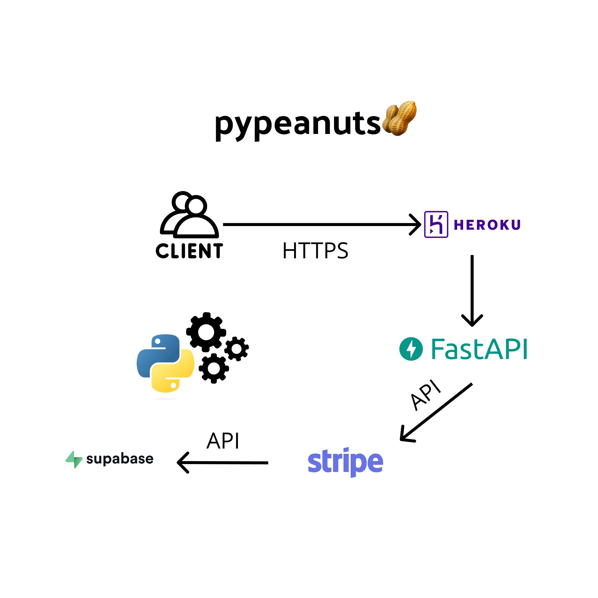

# pypeanuts🥜

## Overview
The APIpeanuts framework is a Python-based solution designed to enable Python package developers to easily monetize their applications. This framework integrates a pay-per-use model using FastAPI, Supabase, Stripe, and Heroku, providing a seamless experience for both package developers and their end users.

## Objectives
- To provide a simple and efficient way for Python developers to monetize their packages.
- To abstract the complexities of payment processing, user authentication, and credit management.

## Features
- **API Key Management**: Secure generation and management of API keys for user authentication.
- **Credit System**: A robust credit purchasing and management system integrated with Stripe.
- **Easy Integration**: Simple decorators for Python functions to enable pay-per-use features.
- **Scalable Architecture**: Utilizing FastAPI and Heroku for high performance and scalability.

## Target Audience
- Individual Python developers or hobbyists.
- Small to medium-sized enterprises (SMEs) developing Python packages.
- Open-source project maintainers looking for monetization solutions.
- Indie Hackers 

## Project Structure
The project is divided into several key components:
- **FastAPI Backend**: Manages API requests, user authentication, and communicates with Supabase for data storage.
- **Supabase Database**: Stores user data, API keys, and transaction records.
- **Stripe Integration**: Handles payment processing and credit allocation.
- **Python Package Integration**: A simple interface for package developers to integrate monetization into their packages.

## Getting Started
To get started with the Hello World Monetization Framework:
1. Clone this repository.
2. Install the required dependencies.
3. Follow the setup instructions in the [Setup Guide](/docs/setup.md).

## Contribution
We welcome contributions from the community. If you wish to contribute:
1. Fork the repository.
2. Create a new feature branch (`git checkout -b feature/YourFeature`).
3. Make your changes and commit (`git commit -am 'Add some feature'`).
4. Push to the branch (`git push origin feature/YourFeature`).
5. Open a new Pull Request.

For more detailed instructions, see the [Contribution Guidelines](/docs/contributing.md).

## License
This project is licensed under the [MIT License](LICENSE).

## Acknowledgements
- FastAPI for the API framework.
- Supabase for database management.
- Stripe for payment processing.
- Heroku for application deployment.

## Support and Contact
For support, questions, or feedback, please open an issue in the GitHub repository or contact us at [maxhager28@gmail.com](mailto:maxhager28@gmail.com).

## Roadmap
For future development plans and current progress, refer to the [Roadmap Document](/docs/roadmap.md).

---

Thank you for considering the APIpeanuts Framework for your Python package monetization needs!
